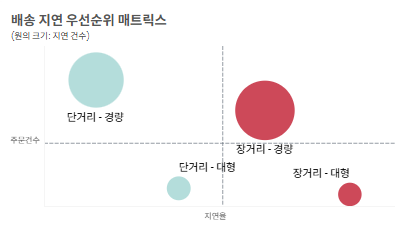
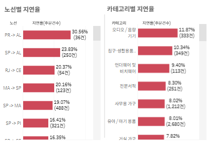
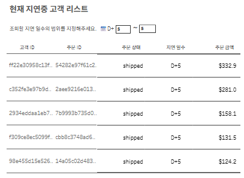

## 📦브라질 이커머스 OLIST 배송 지연 최적화 프로젝트

- OLIST 배송 데이터를 활용해 **배송 지연이 고객 경험에 미치는 영향**을 정량적으로 확인하고,  
   **고객 피해가 큰 지연 세그먼트를 식별해 운영 우선순위와 개선 전략을 제안한 프로젝트**입니다.
  

> 📌 Key Insight  
> 배송 지연 발생 시 리뷰 -2.02점, 재구매율 -16% 감소  
> D+6 이후 만족도 1점대 고착 → D+5 선제 대응 필요

## 🔗 Quick Access

- Dashboard : [Tableau Public 링크](https://public.tableau.com/views/delay_dashboard/2_1?:language=ko-KR&:sid=&:redirect=auth&:display_count=n&:origin=viz_share_link)
- 전처리 및 EDA : [GitHub 링크](https://github.com/eunsung20311-dot/Olist-E-commerce-Analysis/blob/main/01_data_preparation_eda.ipynb)
- 가설 검증 코드 : [GitHub 링크
  ](https://github.com/eunsung20311-dot/Olist-E-commerce-Analysis/blob/main/02_hypothesis_testing.ipynb)

## 1. 프로젝트 개요


### 1) Skills & Workflow

| Category | Tools |
| :--- | :--- |
| **Language** | Python (Pandas, Numpy, Matplotlib) | |
| **Visualization** | Tableau Public |
| **Workflow** | Python → SQLAlchemy ETL → PostgreSQL → Tableau Public |

- Tableau Public 제약으로 최종 시각화는 csv 기반으로 연결했습니다.

### 2) 📉프로젝트 배경

- OLIST는 배송 지연율 **6.57%**, 배송 기간 표준편차 **10일** 수준의 높은 변동성을 보였습니다.
  특히 지연 주문의 **57.6%가 6일 이상 장기 지연**되어 고객 경험과 운영 효율 측면에서 관리가 필요한 상황이었습니다.

### 3) 🎯 문제 정의

- 배송 지연은 단순 운영 이슈를 넘어 **리뷰 및 재구매**에 직접적인 영향을 줄 수 있습니다.
- 하지만 OLIST에는 아래 3가지 문제가 있다고 보았습니다.
  1. **지연 영향의 정량화 부재:** 배송 지연이 고객 경험에 어느 정도 손실을 주는지 수치로 설명되지 않아 개선 우선순위를 잡기 어렵습니다.
  2. **우선 대응 대상의 불명확성:** 어떤 세그먼트와 노선을 먼저 관리해야 하는지 판단 기준이 필요합니다.
  3. **상시 모니터링 체계 부재:** 배송 기간의 변동성이 크지만, 현재 지연 리스크를 지속적으로 추적하고 대응할 수 있는 관제 체계가 없습니다.

<br>

## 2. 데이터 소개

- **활용 데이터:**[Brazilian E-Commerce Public Dataset by Olist (Kaggle)](https://www.kaggle.com/datasets/olistbr/brazilian-ecommerce)
- 2016년부터 2018년까지 **브라질 Olist 이커머스 플랫폼의 약 10만 건 주문 정보**를 담은 공공 데이터셋입니다.
- 고객, 주문, 리뷰, 상품, 판매자, 위치 정보 등 **8개의 관계형 테이블**로 구성되어 있습니다.
- **선정 이유:** 주문, 고객, 판매자, 상품, 위치 데이터를 **고유 ID 기반으로 병합**할 수 있어 배송 지연을 고객 경험, 노선, 상품군, 주문 특성 관점에서 입체적으로 분석할 수 있다고 판단했습니다.
  <br>

## 3. 📊핵심 분석 프로세스

### [PART 1] 배송 지연이 고객 경험에 미치는 영향

**1️⃣ 고객 경험 악화**

- 배송 지연 시 정상 배송 대비 **리뷰 점수는 2.02점 하락**하고, **재구매율은 16% 감소**합니다.
- 즉, 배송 지연은 단순 물류 이슈가 아니라 **고객 경험과 재구매 행동에 직접적인 손실**을 주는 문제임을 확인했습니다.

**2️⃣ 비즈니스 임계점 도출**

- 지연 일수별 평점 추이를 추적한 결과, **지연 6일 차를 기점으로 평점이 1점대로 고착화**되는 것을 확인했습니다.
- 이를 바탕으로 **D+6을 고객 만족 붕괴 임계점**으로 설정했습니다.

### [PART 2] 고위험 지연 세그먼트 진단 및 운영 우선순위 도출

#### 1️⃣ 보조 분석: 배송 난이도 관련 특성 확인

- 공개 데이터에서 운송사/허브 단위 상세 물류 로그는 제공되지 않아,  
  배송 난이도를 반영할 수 있는 **거리, 무게, 부피**를 보조 설명 변수로 선정했습니다.
- 다중 로지스틱 회귀를 수행한 결과:
  - **배송 거리**와 **제품 무게**는 지연 여부와 유의한 양의 관련을 보였습니다.
  - **제품 부피**는 본 모델에서 유의하지 않았습니다.

#### 2️⃣ 운영 세그먼트 설계

- 보조 분석 결과를 바탕으로, **거리 × 무게** 기준으로 주문을 4개 세그먼트로 구분했습니다.

> **세그먼트 분류 기준**
>
> - **무게:** 일반 택배 가이드라인을 고려한 **5kg 기준** (경량 / 대형)
> - **거리:** 브라질 평균 권역 외 이동 거리인 **500km 기준** (단거리 / 장거리)

#### 3️⃣ 우선순위 매트릭스 구축

- 각 세그먼트별 **주문량과 지연율**을 함께 비교해,  
   고객 피해 규모와 운영 개선 효과가 큰 그룹을 우선 대응 대상으로 정의했습니다.
  <br>

## 4. 🎯 데이터 기반 전략 제안

### 1️⃣ 창고 선진입 전략

- **타겟:** 경량 / 장거리 주문 세그먼트 (**≤ 5kg, > 500km**)
- **데이터 근거:** 주문 건수가 약 **3.5만 건**으로 가장 크고, 지연율도 **8.21%**로 높아 **고객 피해 규모와 개선 효과가 모두 큰 우선 대응 대상**으로 판단했습니다.
- **해석:** 경량 상품은 재고 선배치가 상대적으로 용이하므로, 장거리 배송 구조 자체를 줄이는 방식이 적용 가능하다고 보았습니다.
- **전략 가설:** 주문량이 집중되는 장거리 노선 종착지 근처에 협력사 풀필먼트 창고를 활용해 재고를 전진 배치하면, 기존 장거리 배송 일부를 단거리 배송으로 전환할 수 있고, 이로 인해 지연율과 배송 시간을 낮출 수 있습니다.

### 2️⃣ 대형 화물 이원화 전략

- **타겟:** 대형 / 장거리 주문 세그먼트 (**> 5kg, > 500km**)
- **데이터 근거:** 이 세그먼트는 지연율이 **9.63%**로 전체 세그먼트 중 가장 높아, **심각도 기준 최우선 관리 대상**으로 보았습니다.
- **해석:** 대형·중량 상품은 일반 배송 네트워크에서 상하차 및 분류 부담을 키울 가능성이 있어 별도 관리 필요성이 높다고 판단했습니다.
- **전략 가설:** 대형 가구 및 가전을 전문으로 취급하는 특수 물류 업체와의 계약을 통해 배송망을 이원화하면, 일반 상품과 분리 운영이 가능해지고 장거리 대형 화물의 병목을 줄일 수 있습니다.

### 3️⃣ 평점 방어 CRM 전략

- **타겟:** 임계점에 임박한 지연 경험 고객
- **데이터 근거:** 지연 **6일차 이후 리뷰 평점이 1점대에 고착**됩니다.
- **전략 가설:** 지연 일차별 접근을 달리하여 평점을 방어할 수 있습니다.4일차에 선제적 정보를 공개/ 5일차 임계점 직전에 보상을 선지급/ 6일차 배송 지연 전담 상담사 연결 카톡을 발송 등을 통해 고객의 불안을 해소합니다.

<br>

## 💻 5. 실무 활용을 위한 Tableau 대시보드 구현

1️⃣ **우선순위 매트릭스** 

- 가장 우선적으로 개입이 필요한 핵심 병목 세그먼트를 직관적으로 식별하기 위해, 거리와 무게를 그룹화하여 2x2 매트릭스 형태의 버블 차트를 구축했습니다.

2️⃣**노선/카테고리 리스트** 

- 매트릭스 차트에서 특정 위험 구간(예: 장거리-경량)을 클릭하면 하단의 [노선별 / 카테고리별 지연율 및 주문 건수] 데이터가 실시간 인터랙션(대시보드 필터)으로 연동됩니다.

3️⃣**지연중 고객 리스트 추출** 

  * 매개변수 필터로 지연일수의 범위를 입력하면, 현재 지연을 경험하는 **[지연중 고객 리스트]** 가 추출됩니다.

<br>

## 📈 6. 기대 효과

본 분석과 대시보드를 실무에 도입할 경우, 다음과 같은 개선을 기대할 수 있습니다.

1. **고객 피해가 큰 지연 대상의 빠른 식별**
   - 임계점(D+4~5)에 도달한 지연 고객과 고위험 세그먼트를 빠르게 파악할 수 있습니다.

2. **운영 리소스 최적화**
   - 모든 주문을 동일하게 관리하는 대신,  
     주문량과 지연율이 모두 높은 세그먼트 및 노선에 물류 개선 비용을 집중할 수 있습니다.

3. **부정 리뷰 및 이탈 방어**
   - D+6 임계점 이전에 타깃 고객군을 선별해 선제적 안내와 보상 전략을 적용함으로써 고객 만족 하락을 완화할 수 있습니다.

4. **상시 관제 체계 구축**
   - 단순 평균 배송일이 아니라, 지연율·장기 지연율·우선 대응 세그먼트 중심의 모니터링 체계를 운영할 수 있습니다.

### 📝 KPT 회고

```text
🟢 Keep

* End-to-End 데이터 파이프라인 경험
  - 파이썬을 통한 전처리부터 태블로 대시보드 시각화까지의 전체 데이터 흐름을 주도적으로 설계했습니다.

* 비즈니스 문제를 운영 액션으로 연결하는 분석 경험
  - 고객 경험 손실을 정량화하고, 이를 세그먼트 우선순위와 대시보드 액션으로 연결했습니다.

🔴 Problem

* N:M 관계 테이블 병합 시 정합성 리스크
  - Olist 데이터셋의 복잡한 관계 구조로 인해 병합 시 총 지표 왜곡 가능성이 있었습니다.

* 배송 지연 정의 노이즈
  - 초 단위 초과 데이터까지 기계적으로 지연으로 정의하면 노이즈가 발생했습니다.


🔵 Try

* 데이터 정합성 검증 루틴화
  - 데이터 적재 및 시각화 전 단계에서 원본 시스템과 수치를 소수점까지 비교 검증하는 단계를 루틴화하여 결과의 신뢰도를 높이겠습니다. 